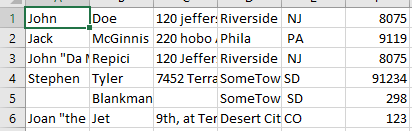
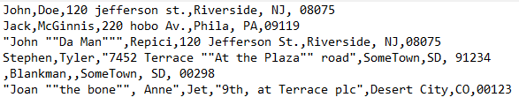

--- 
title: "Parsing a Text File"
author: "Molly Miraglia"
output:
  prettydoc::html_pretty:
    theme: leonids
    highlight: github
editor options:
  chunk_output_type: console
---

```{r setup, include =FALSE}
library (tidyverse)
library(reticulate)
use_python("C:/Users/ogros/anaconda3/envs/r-reticulate/python.exe")
library(png)
```

## Using Python for Data Manipulation

Suppose you have a text file containing over one-thousand rows. Your employer wants you to extract significant data from every row into a new text file. Doing this process manually could take a week or more. Your eyes begin to get sore from looking at a screen your entire work day. You might even bring work home to finish this task. What if there was a way to complete this task by working for one day and letting it 


### Hello World, Welcome to Python!

This document is intended for users that have a beginner knowledge of programming. By now, you should already be familiar with the basics of Python. The presumed topics would be basic data types, operators, and operations. Data types include integers, floats, strings and lists, operators include mathematical symbols, and operations include if/elif/else statements. Please refer to any reliable Python resources if needed, but there will be plenty of review throughout this document. A reliable Python resource can include the official [Python Documentation](https://docs.python.org/), or my personal favorite is [W3Schools Python Tutorial](https://www.w3schools.com/python/default.asp). My mentor Stephanie J. Spielman, Ph.D. has an extremely (### I FORGET THE WORD, IT'S LIKE COHESIVE AND VERY INFORMATIVE) 4 day course on rudimentary Python skills for Biologists called [Introduction to Python](https://sjspielman.github.io/bdib2018_python/), which is what I always check when I forget something. The most important resource of all would be Google. Never (### REGRET AND ALSO DELAY) to Google anything, it can save so much time. 

Once you have established your ability in knowing you can comprehend this document, let's get started! Many large datasets (also known as big data) can be found in the format as .csv files. A .csv file stands for a comma separated value file. If a .csv file were to be opened in Microsoft Excel, each value would be in its own cell. However, if opened in a regular text editor, there would be a visible comma between each value. Below is an example .csv file opened in two separate applications, Microsoft Excel and Notepad respectfully. 




As you can see in Notepad, the data is in its RAW format, which hasn't been compiled or manipulated in any way. 


On the topic of text editors, a reminder, Microsoft Word is not a text editor! A few recommendations of mine vary for different operating systems. For Windows, I highly recommend Notepad++. For MacOS I recommend BBEdit. If using a Linux machine, just download Microsoft Visual Studios, which is actually an IDE. You could also substitute any text editor for any operating system for Microsoft Visual Studios, however the mentioned text editors are all open source. Microsoft Visual Studios is open source to an extent. You can compile 

Most .csv files you're going to be dealing with will be RAW. You will have to extract the required information while also adding a header and cleaning up the data. Which is essentially what parsing is! 

There are so many modules that can help you achieve what you need, but first this will be done without the help of modules.

## Two Friends Go Walkin' They Both Do The Talkin

Introducing split() and .strip(). These two methods are essential in parsing a text file. These methods are used in text parsing when they retain to a string, not a byte.

According to the official Python Documentation, .split() returns a list based on the delimiter provided. Let's do an example!

```{python}

str1 = "A,B,23,F" 

str1.split(",")

```
You can see that the .split() method took 

## Resources

https://people.sc.fsu.edu/~jburkardt/data/csv/csv.html, https://people.sc.fsu.edu/~jburkardt/txt/gnu_lgpl.txt - where i got the .csv file

